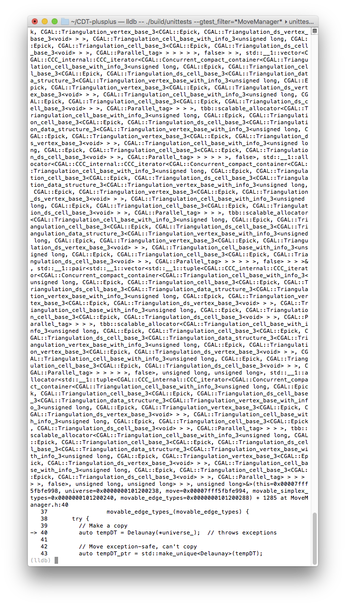
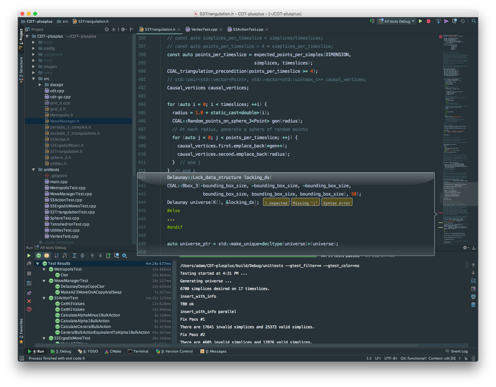

Title: Atom vs. CLion
Date: 2016-04-17
Category: Programming
Tags: c++, atom, clion

Today I decided to give [CLion][1] a try. I need all the help I can get.

(I also should mention that JetBrains generously gives [free CLion licenses][7]
to students, teachers, and non-commercial open source projects.)

[Atom][2] is very nice, and I've been using it since 0.1 for everything from
$\LaTeX$ing papers to writing this blog to everyday coding. However, my
latest travails involve heavy use of the [debugger][3], and doing so with
heavily templated code on the command line is not so nice.

So I was lured in with the promise of a nice, graphical debugger in an honest
IDE.

After tinkering around with it for an hour or so, and trawling through the
forums, I've managed to get CLion to look very close to my Atom setup, except
for the different syntax highlighting colors. But I'll get used to that,
or I can always customize the color scheme to Atom's material syntax if it
really bothers me.

Pros:

- Code completion is nice.
- Refactoring is wonderful. Also, CLion is smart enough to point out things
you don't need, such as .gitignore items covered by other definitions. In
general, CLion seems to have a lot of best practices baked right in.
- It's really nice to be working with a tool that understands the
[C++ constructs][8], instead of just doing some clever pattern matching.

Cons:

- No option to use [Ninja][4] as my build tool. This increases build times
perceptibly (but a [hack][5] exists).
- Inexplicably builds in some hidden directory instead of the output directory
(but see the [roadmap for 2016.2][6]).
- The debugger skips right past my set breakpoints.

Sadly, the last two are pretty much dealbreakers.

I've submitted a support request, and I really think that CLion 2016.2 looks
very promising.

But as of now I'll still be writing/<del>coding</del> in Atom.

[1]: https://www.jetbrains.com/clion/
[2]: https://atom.io
[3]: http://lldb.llvm.org
[4]: https://ninja-build.org
[5]: http://nevkontakte.com/2015/rogue-ninja-support-in-clion.html
[6]: https://blog.jetbrains.com/clion/2016/03/clion-2016-2-roadmap/
[7]: https://www.jetbrains.com/clion/buy/#edition=discounts
[8]: http://www.meetup.com/SF-Bay-Area-Cpp/events/228070137/
