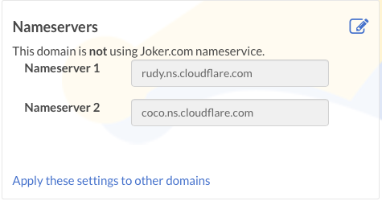
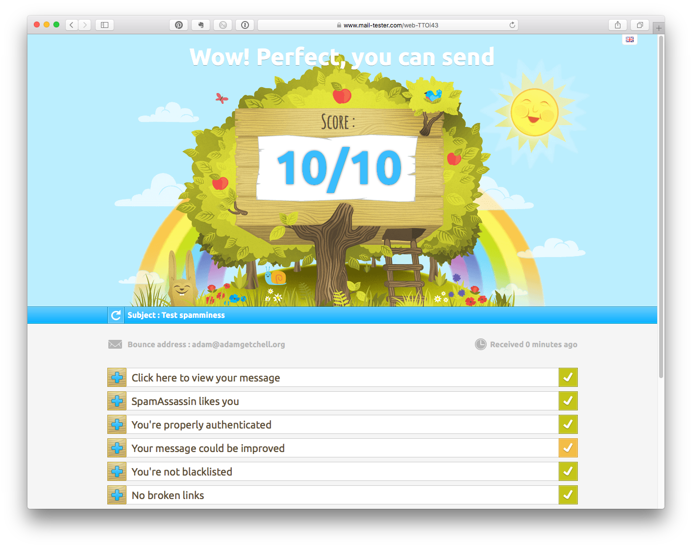
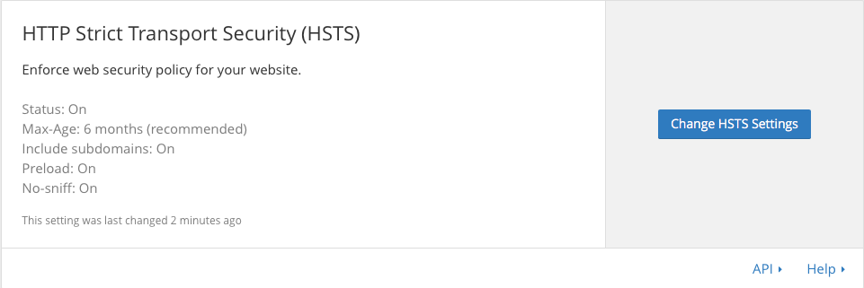

Title: Secure, Verifiable, Public Identity
Date: 2016-08-12
Category: Misc
Tags: prismbreak

For awhile, I've been interested in establishing a secure, verifiable, public identity.

There are [any][15] [number][16] of reasons to do this, for example, [authenticity][19] and
[non-repudiation][20],
[frictionless sharing of files][1], and so forth. But that's the topic of another article.
What I want to talk about here is how I got to the promised land.

First up is [Keybase](https://keybase.io), which is a really awesome software stack that
maps your identity to your public keys. You might want to [read about][1]. Go ahead, I'll
wait.

Signup is currently by invite only, but if you know [someone][2] already on it you might be
able to wrangle an invite.

When you do sign up, the first thing they ask for is an email address. Of course, we all
know that email is notoriously insecure, subject to spamming, ad-analytics, and any number
of security maladies, but I didn't want to bow to that (seeming) inevitability.

As it turns out, this was the perfect opportunity to use another highly secure service I'd
been playing with: [ProtonMail][3].

ProtonMail has encrypted identities in order to retrieve, housed in Switzerland
(so certain entities won't obtain access easily), encrypted again with your own key which
ProtonMail doesn't know so that they cannot access your data, has mobile app
versions, and implements all the right sorts of technologies to patch up the leaky sieve
of general purpose electronic correspondence.

Now, if I'm going to bother to have a vanity domain like [adamgetchell.org][4], I may as well
have an email address like adam@... So while the free version of [ProtonMail][3] is fine
for tinkering, I stepped up to a paid account in order to get these and other features, as
we'll go over shortly. For $48 per year, not too bad, and I felt good about supporting the
good guys.

The first step towards greater email security is to verify you own your domain.

My domain registrar is [Joker][5], a fine German domain registrar housed in Switzerland.
ProtonMail provides a nice wizard to step you through everything, so from that:

You go to your DNS registrar and add the requested TXT record. [Validate it][17].

Next, you'll need to add the MX record for your vanity domain, with the data that ProtonMail
supplies. There's a pretty screenshot I could show, but data is rather trivial: set up an
MX record, with a value of `mail.protonmail.ch` and a priority of `10`, and you're good to
go. Give it some time to propagate through DNS-land; eat lunch, or have some coffee, or play
your favorite game for a tick or two.

Now you can just add the address in ProtonMail's Wizard (Settings->Domains)

Alright, vanity email address, $\checkmark$. Now it's time to secure it.

First, you don't want someone to be able to fake your brand new domain. This is where
[DNSSEC][6] comes in. However, in my case, [Joker][5]'s DNS servers don't support it. No
problem -- switch to someone who does!

That someone is [CloudFlare][7].

CloudFlare is a cool service that boosts your website speed via optimizations and CDNs, helps
protect your website against some forms of malicious attacks, and can even mitigate DDoS.
In this case, I'm interested in them because they provide fast, secure DNS, and because I can
get a free account for my single website. What's not to like?

I also highly recommend them in general. I've used them for a number of years professionally,
and they've been worth the cost.

Anyways, on Joker I can specify the CloudFlare will be my DNS server like so:

A helpful wizard will pop up telling you that you're about to tranfer records over, which
you should do. (Actually, I turned on DNSSEC much later in the process than what I'm listing
here. Thus, most of my DNS changes were actually made on Joker's DNS servers, then migrated
over to CloudFlare. That worked just fine.)

Once you've verified that CloudFlare is now handling your DNS, it's a simple matter to
switch on DNSSEC:

Now, back to email! We want to prevent someone from spoofing messages. Time for [DKIM][9],
[SPF][10],and [DMARC][11].

Here's ProtonMail's guide to setting up [Anti-spoofing for Custom Domains][8].

Whew! That was a long detour, but now we have a secure email address to use for [Keybase][1].

Once you've install Keybase (e.g. `brew cask install keybase`), you'll want to note down your
'paper' key someplace safe (like, say, a Secure Note in [1Password][12]). And then, you'll
want to start adding identities, such as Twitter, GitHub, Reddit, and your website.

This is pretty straightforward, but I'm going to linger on that last one a bit.

If you want your website to be part of your identity, you'll want it to be secure. My website
happens to be generated by Pelican and hosted on GitHub, for which I have 2-factor
authentication turned on. But by default, GitHub hosted sites don't support SSL.

But [CloudFlare][7] does. So we come to the second reason for using CloudFlare: enabling
`https` on your static site. It's as easy as flicking a switch:

**HOWEVER** This is not complete, as this only encrypts communication between the client
browser and CloudFlare. [The connection between CloudFlare and GitHub is unencrypted for
custom domains][13]. This is also easy to do [the wrong way][18].

If you didn't have a custom domain, then this doesn't apply. But where's the fun in that?

Finally, to prevent the client from downgrading from `https` to `http`, you can turn on
HTTP Strict Transport Security.

This comes with some sizeable caveats, so definitely read them.

Finally, you can check your work here: [https://en.internet.nl][14].

And now you have a [nice, secure, publicly verifiable identity][1]:

[1]: https://keybase.io/docs/kbfs
[2]: https://keybase.io/adamgetchell
[3]: https://protonmail.com
[4]: https://adamgetchell.org
[5]: https://joker.com
[6]: http://dnssec.net
[7]: https://www.cloudflare.com
[8]: https://protonmail.com/support/knowledge-base/anti-spoofing/
[9]: http://www.dkim.org
[10]: http://www.openspf.org
[11]: https://dmarc.org
[12]: https://1password.com
[13]: https://konklone.com/post/github-pages-now-sorta-supports-https-so-use-it
[14]: https://en.internet.nl
[15]: https://keybase.io/blog/2014-10-08/the-horror-of-a-secure-golden-key
[16]: http://www.zdnet.com/article/microsoft-secure-boot-key-debacle-causes-security-panic/
[17]: https://docs.menandmice.com/display/MM/How+to+test+DNSSEC+validation
[18]: https://thehackerblog.com/keeping-positive-obtaining-arbitrary-wildcard-ssl-certificates-from-comodo-via-dangling-markup-injection/index.html
[19]: https://www.youtube.com/watch?v=pDmj_xe7EIQ
[20]: http://security.stackexchange.com/questions/6730/what-is-the-difference-between-authenticity-and-non-repudiation
